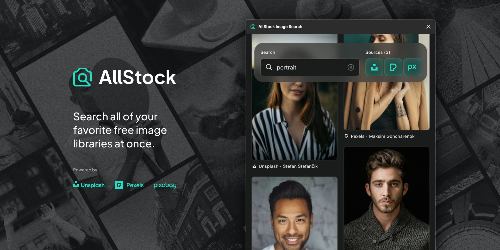

// import Video from "@components/Video";

A little Figma plugin I released last year recently passed 2K users. Not bad for a project that I published and then never publicly discussed.

It's called AllStock, and it's a one-stop shop for finding and using high-quality images directly inside of Figma. It allows users to browse popular free photo libraries like Unsplash, Pexels, and Pixabay all at the same time without needing to leave their design file.

The project started as a learning exercise to explore Figma's plugin API. Unexpectedly, a nontrivial number of people have found it useful, so over the holiday break I decided to dive back in and rebuild it into a more proper product.

In the end, I overhauled every part of the codebase from scratch, from the interface to the APIs. Here are some of my favorite details from the project:

## Easier Access

You can now launch the plugin directly from Figma's quick actions menu (Figma's native launcher—think spotlight or Raycast). In your Figma design file, simply type `command + /` on Mac to access the quick actions menu, and then enter "allstock" and your search query to get started.

## More Performant

In the first version of the plugin, I imported images directly from the relevant image service. It was efficient to build, but the size of the raw images ended up being a liability, slowing down—and occasionally even crashing—the plugin. Now, I'm using ImageKit to optimize images before importing them. As a byproduct, this also affords users more control over the output size and quality of photos.

<Video
  src="https://res.cloudinary.com/andystewartdesign/video/upload/v1707389217/work/figma/allstock-demo-1920x1080.mp4"
  autoplay
  muted
  loop
  client:load
/>

## More Secure

Figma plugins are frontend applications, meaning there's no straightforward way to protect secret keys. In the original build, I did my best to obfuscate all requisite API keys, but it was admittedly a bit hacky. Now, I'm proxying all requests through Vercel edge functions, meaning the API keys never have to touch the client side code. (And don't worry—I got new keys, too.)

## Streamlined Interface

If I'm honest, a lot of the "back end" work is in service of allowing me to design the front end. The new interface simplifies the search process by getting lesser-used options out of the way and putting the search input and service select boxes front and center. Additional filters can be accessed in an offscreen dialog as needed. Other quality of life features, such as previewing larger versions of images before importing them, and browsing results in a custom masonry-style layout, help make the experience feel more polished and complete.

I love side projects like this, especially when they take me in directions that I don't expect. To learn more and try it out, [visit the Figma community page.](https://www.figma.com/community/plugin/1235675201027690011)
